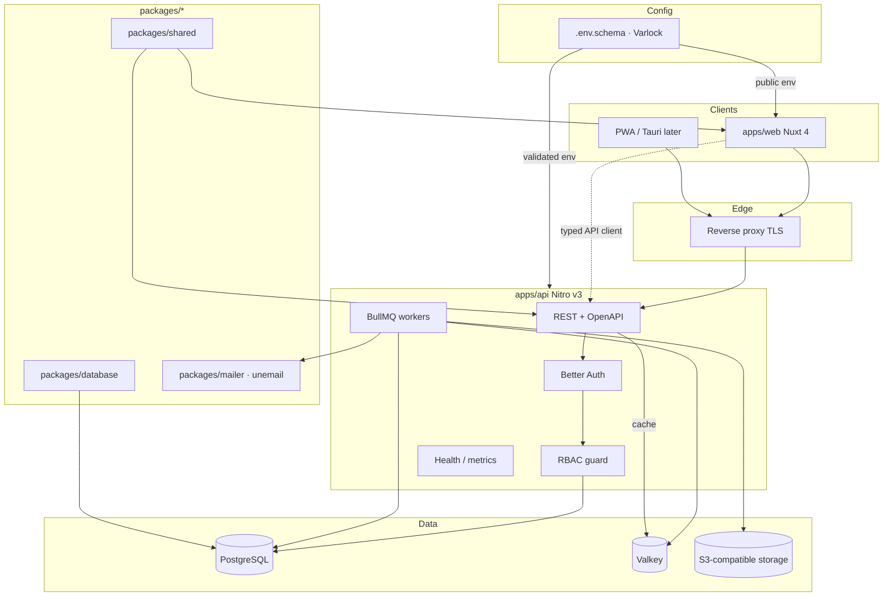

# Stampp — Product & Engineering Plan

**Positioning:** Open-source work-time platform. No seat pricing, no feature gates, fully self-hostable.

**Target competitors (long-term):** Clockify, Toggl Track, Harvest — not as a clone, but as a generic org → workspace → client → project → time platform.

**Current repo state:** Vite+ monorepo scaffold with `apps/web` (Nuxt 4 + Nuxt UI + Pinia) and `apps/api` (Nitro v3). No `packages/*` yet. CI runs check/typecheck/test/build. This plan turns that scaffold into a production system without rewriting the toolchain.

---

## 1. Non-negotiable product principles

1. **Everything enabled.** No paid feature gates. Self-hosters get the full product.
2. **Privacy-first.** Monitoring modules (screenshots, GPS, activity) ship **disabled by default**, with employee-visible indicators when enabled.
3. **Exportable by design.** Full workspace JSON + CSV/XLSX/PDF + DB backup. Users must be able to leave cleanly.
4. **Multi-tenant by construction.** Every table and API path is workspace-scoped. No “add tenancy later.”
5. **Historical integrity.** Rate changes never rewrite history. Approved/locked time is immutable except via audited manager override.
6. **Grow in layers.** Ship the smallest end-to-end product that works, then add capabilities on top of a working base. No half-built verticals.

---

## 2. Architecture overview



**Deployment unit:** one API process + one web process + PostgreSQL + **Valkey** + object storage. Canonical path remains `docker compose up -d`.

### Deployment topology (v0.1–v0.2)

Keep **two apps, one origin**:

- `apps/web` is the product UI (SSR).
- `apps/api` is the system of record and public API.
- Web talks to API over HTTP with session cookies (same-site) or short-lived tokens.
- Reverse proxy mounts `/` → web, `/api` → api (or web proxies via Nitro route handlers later if desired).

Do **not** merge web and api into one Nitro app in v0.1. Separate deployables keep API parity honest and allow future mobile/desktop clients.

---

## 3. Monorepo layout (target)

```text
stampp/
├── .env.schema                # shared env schema (APP_ENV, PUBLIC_APP_URL, …)
├── apps/
│   ├── web/                 # Nuxt 4 product UI
│   │   └── .env.schema      # public + web-only keys; @import root
│   └── api/                 # Nitro v3 HTTP API + workers
│       └── .env.schema      # DATABASE_URL, BETTER_AUTH_*, SMTP_*/mail drivers, VALKEY_URL, STORAGE_*, …
├── packages/
│   ├── access/              # WorkspaceAccess + AuthorizedContext (deep seam)
│   ├── database/            # Drizzle schemas, scoped db, migrations
│   ├── domain/              # Pure: money, duration, rate types, rounding
│   ├── shared/              # Valibot HTTP schemas, error codes only
│   └── mailer/              # UnEmail + MailDispatch adapter (BullMQ worker)
├── tools/
│   └── oxlint/anti-slop/    # existing — leave alone
├── deploy/
│   ├── docker/              # Dockerfiles, compose
│   └── k8s/                 # later
└── docs/
```

| Package             | Responsibility                                                  | Depends on                     |
| ------------------- | --------------------------------------------------------------- | ------------------------------ |
| `packages/access`   | `enterWorkspace` → AuthorizedContext (session, RBAC, scoped db) | database, shared               |
| `packages/database` | Drizzle ORM, `createScopedDb(workspaceId)`, migrations          | `drizzle-orm`, `postgres`/`pg` |
| `packages/domain`   | Pure money/duration/rate types/rounding — no HTTP, no DB        | (none)                         |
| `packages/shared`   | Valibot request/response schemas, error codes                   | `valibot`                      |
| `packages/mailer`   | MailDispatch (`notify`) over BullMQ + UnEmail transport         | `unemail`, `bullmq`            |

**Rule:** domain rules live in `packages/domain` (pure) and deep modules (TimeTracking, Rates). Apps stay thin: HTTP/UI only. **Env is declared in `.env.schema` (Varlock).** Glossary: `CONTEXT.md`.

---

## 4. Domain model (v0.1 core)

Extend TARGET.md’s hierarchy with operational fields required for multi-tenancy, RBAC, and audit from day one.

```text
Better Auth Organization  ← product name: Workspace (tenancy root)
 ├── Member (Better Auth)           # role: owner | admin | manager | member | guest
 ├── Invitation (Better Auth)
 ├── Client
 │    └── Project
 │         ├── Task
 │         ├── ProjectMember
 │         └── TimeEntry
 ├── Team / TeamMember              # plugin teams later; optional app tables if needed
 ├── Tag
 ├── User (Better Auth user)        # global identity
 └── workspace_settings             # app-owned policy JSONB
```

TARGET.md’s parent **Organization** (one company, many workspaces) is **not** modeled in v0.1. Most self-hosts are 1 company = 1 Better Auth organization. If multi-workspace companies appear later, add a thin app-owned `companies` table and FK workspaces to it — do not fork auth membership.

### Core tables (v0.1)

| Table                     | Notes                                                                                       |
| ------------------------- | ------------------------------------------------------------------------------------------- |
| **Better Auth (library)** | `users`, `sessions`, `accounts`, `verifications`, `organizations`, `members`, `invitations` |
| `clients`                 | Workspace-scoped; `workspace_id` → `organizations.id`                                       |
| `projects`                | Client optional; status, billable, color, code                                              |
| `tasks`                   | Project-scoped; optional estimate                                                           |
| `project_members`         | User access to private projects                                                             |
| `time_entries`            | User, project?, task?, start/end or duration, billable, description, tags                   |
| `time_entry_tags`         | M2M                                                                                         |
| `tags`                    | Workspace-scoped                                                                            |
| `workspace_settings`      | One row per workspace; JSONB policy blob with validated shape                               |
| `audit_events`            | Append-only; start writing in v0.1 even if UI is later                                      |

Do **not** add Stampp-owned `workspaces` / `memberships` tables in v0.1 — they would duplicate Better Auth’s organization/member model (see §6.4).

### Identifier policy

- App-generated text IDs with entity prefixes (`ws_…`, `prj_…`, `te_…`).
- No serial PKs (matches project Drizzle skill: migration-safe, restore-safe).
- Soft-delete only where business requires archive (`clients`, `projects`, `users` deactivate). Time entries are hard-deleted only before approval; approved data is locked.

### Time entry rules (critical)

Owned by deep module **TimeTracking** (not raw handlers):

| Command                 | Invariants                                                      |
| ----------------------- | --------------------------------------------------------------- |
| `start(ctx, input)`     | No other running timer; project access; billable defaults       |
| `stop(ctx, entryId)`    | Entry belongs to actor (or `time:write:other`); closes interval |
| `addManual(ctx, input)` | Overlap check; duration xor interval                            |
| `update` / `remove`     | Locked/approved entries rejected (historical integrity)         |
| `range(ctx, filter)`    | Scoped read for lists, timesheets, reports                      |

- Store **UTC instants** + user timezone snapshot.
- Allow either `start_at`/`end_at` **or** `duration_minutes` (manual).
- Exactly one running timer per user per workspace in v0.1.
- Overlap prevention enforced **inside** TimeTracking (transaction + constraint).
- Rounding applied at **report/invoice time**, not by mutating stored duration.

HTTP `/timer/*` and `/time-entries` are adapters over these commands.

### Rates (deep module — locked)

|                |                                                                                                     |
| -------------- | --------------------------------------------------------------------------------------------------- |
| **Interface**  | `resolveEffective(ctx, { userId, projectId, taskId, at })` → `{ billable, cost, currency, source }` |
| **Precedence** | task → project → user-in-project → user → org (fixed; not workspace-configurable)                   |
| **History**    | As-of `at` required so rate changes never rewrite historical money                                  |
| **Consumers**  | reports, invoices (v0.2), profitability                                                             |

---

## 5. Data layer

**Stack:** PostgreSQL 16+ + Drizzle ORM.

Connection string comes from Varlock (`ENV.DATABASE_URL` / `process.env.DATABASE_URL` after load). No second env parser in `packages/database`.

### Layout (`packages/database`)

```text
packages/database/
├── src/
│   ├── client.ts            # createDb, types
│   ├── config.ts            # drizzle.config.ts equivalent
│   ├── schemas/
│   │   ├── _helpers.ts      # timestamptz, id helpers
│   │   ├── auth.ts
│   │   ├── org.ts
│   │   ├── time.ts
│   │   ├── projects.ts
│   │   └── audit.ts
│   └── repositories/        # optional thin query modules
├── migrations/
└── tests/
```

### Conventions (aligned with existing Drizzle skill)

- Tables: plural `snake_case`.
- Columns: `snake_case`.
- Single-column surrogate PK; business uniqueness via `uniqueIndex`.
- Every workspace-scoped table has `workspace_id` **not null** + composite indexes starting with `workspace_id`.
- Timestamps: `created_at`, `updated_at` timestamptz.
- Money: integer **minor units** + `currency` (ISO 4217). Never floats.
- Durations: integer **minutes** (or seconds if sub-minute needed later; start with minutes).

### Multi-tenancy enforcement

1. **Always** filter by `workspace_id` in repositories/handlers.
2. Authorization middleware resolves membership before any query.
3. Prefer Postgres **Row-Level Security** starting v0.2 once auth is stable (defense in depth). v0.1 can ship app-level checks only if tests prove isolation; RLS is not optional for v1.0.

### Migrations

- Drizzle Kit migrations committed to repo.
- API applies migrations on boot **or** via explicit `migrate` task (prefer explicit task in production; auto-migrate only in compose for simplicity).
- Never edit an applied migration; generate a new one.

---

## 6. AuthN / AuthZ — Better Auth

**Locked decision:** use **Better Auth `1.7.x`** (latest on npm at plan time: **1.7.5**) as the sole authentication and organization-membership authority.

Verified fit:

| Need                        | Better Auth support                                           |
| --------------------------- | ------------------------------------------------------------- |
| Nuxt 4 / Nitro handler      | Official docs: `auth.handler(toWebRequest(event))` catch-all  |
| Vue client + SSR session    | `better-auth/vue` + `useSession(useFetch)`                    |
| Drizzle + PostgreSQL        | `@better-auth/drizzle-adapter` (`provider: 'pg'`)             |
| Orgs, invites, teams, roles | `organization` plugin (+ optional `teams: { enabled: true }`) |
| Typed access control        | `better-auth/plugins/access` + `plugins/organization/access`  |
| 2FA / passkeys / magic link | First-party plugins                                           |
| API tokens / bearer         | `bearer` + API-key style plugins (v0.2)                       |

Do **not** roll a custom password/session system. Do **not** dual-source membership in a parallel table for v0.1.

### 6.1 Placement (single auth authority)

Auth lives in **`apps/api`** (Nitro), not in Nuxt server routes:

```text
Browser ──► reverse proxy (same origin)
              /        → apps/web (Nuxt SSR)
              /api/*   → apps/api (Nitro)
                           ├── /api/auth/*     Better Auth handler
                           └── /api/v1/*       product REST API
```

Why API owns auth:

1. One place validates sessions for product routes (`auth.api.getSession({ headers })`).
2. Future mobile/desktop/Tauri clients hit the same `/api/auth` without a second integration.
3. Nuxt stays a pure UI consumer via `better-auth/vue` client pointed at `/api/auth`.

### 6.2 Package layout

```text
packages/database/src/schemas/auth.ts   # generated/adapted Better Auth Drizzle schema
apps/api/server/utils/auth.ts           # betterAuth(...) instance (singleton)
apps/api/server/api/auth/[...all].ts    # mount: auth.handler(toWebRequest(event))
apps/api/server/middleware/auth.ts      # session → event.context.session
apps/api/server/utils/requireAuth.ts    # requireSession + requireWorkspaceRole(...)
apps/web/app/lib/auth-client.ts         # createAuthClient from better-auth/vue
apps/web/app/composables/useAuth.ts     # SSR cookie-forwarding client helper
```

Catalog pin (add to `pnpm-workspace.yaml`):

```yaml
catalogs:
  auth:
    better-auth: 1.7.5
    '@better-auth/drizzle-adapter': 1.7.5
  mail:
    unemail: 0.7.0
  queue:
    bullmq: catalog-pin-at-m0
    ioredis: catalog-pin-at-m0
```

Renovate may bump within `1.7.x`; major upgrades are explicit PRs with auth-flow E2E.

### 6.3 Server config (shape)

```ts
// apps/api/server/utils/auth.ts
import { betterAuth } from 'better-auth';
import { drizzleAdapter } from '@better-auth/drizzle-adapter';
import { organization } from 'better-auth/plugins';
import { access, ac, member, admin, owner } from 'better-auth/plugins/access';
// plus organization access helpers when defining stampp roles

export const auth = betterAuth({
  appName: 'Stampp',
  secret: env.BETTER_AUTH_SECRET,
  baseURL: env.BETTER_AUTH_URL, // public origin, e.g. https://stampp.example.com
  basePath: '/api/auth',
  database: drizzleAdapter(db, {
    provider: 'pg',
    schema: authSchema, // from packages/database
    usePlural: true, // users, sessions, organizations, members, ...
  }),
  emailAndPassword: {
    enabled: true,
    requireEmailVerification: true,
  },
  session: {
    expiresIn: 60 * 60 * 24 * 7,
    updateAge: 60 * 60 * 24,
    cookieCache: { enabled: true, maxAge: 5 * 60 },
  },
  advanced: {
    database: { joins: true },
    useSecureCookies: env.isProd,
  },
  plugins: [
    organization({
      // Stampp mapping: Better Auth "organization" == product "workspace"
      teams: { enabled: false }, // enable when Team features land (v0.2+)
      allowUserToCreateOrganization: true, // self-host open registration; instance setting later
      requireEmailVerificationOnInvitation: true,
      async sendInvitationEmail(data) {
        await notify({ type: 'workspace.invite' /* … */ }); // MailDispatch only
      },
      organizationHooks: {
        afterCreateOrganization: async ({ organization, member }) => {
          await audit.write({
            workspaceId: organization.id,
            actorUserId: member.userId,
            action: 'workspace.created',
            entityType: 'workspace',
            entityId: organization.id,
          });
        },
      },
    }),
    // v0.2+: twoFactor(), passkey(), bearer / API key plugins
  ],
});
```

Auth env (declared in `.env.schema`, loaded via Varlock — see §5.1):

```env-spec
# Better Auth secret — high entropy, ≥ 32 chars
# @required @sensitive @type=string(minLength=32)
BETTER_AUTH_SECRET=

# Public origin of the app (same origin behind reverse proxy)
# @required @type=url
BETTER_AUTH_URL=
```

API code reads typed values from `varlock/env` (`ENV.BETTER_AUTH_SECRET`) or `process.env` after `varlock run` / `varlock/auto-load`. Do not hand-roll Valibot boot checks for env.

### 6.4 Domain mapping: Organization = Workspace

| Better Auth concept      | Stampp product concept          |
| ------------------------ | ------------------------------- |
| `organization`           | **Workspace** (tenancy root)    |
| `member`                 | Workspace membership            |
| `invitation`             | Workspace invite                |
| `activeOrganizationId`   | Active workspace on the session |
| `team` (optional plugin) | Team / department grouping      |

**Do not** create a separate Stampp `workspaces` table that duplicates Better Auth organizations in v0.1. TARGET.md’s parent `Organization` (multi-workspace company) can be a thin app-owned table in v0.2+ if needed; most self-hosts are 1 company = 1 workspace.

Workspace-scoped product tables FK to `organizations.id` (Better Auth org id) as `workspace_id`.

Active workspace: use `authClient.organization.setActive()`; server handlers accept explicit `organizationId` (path or body) and **must** verify membership — never trust client-only active org for authorization.

### 6.5 Roles & permissions (AuthZ)

Start from Better Auth access-control (`ac` + role helpers), then extend with Stampp permissions. Ship these roles in v0.1:

| Role      | Base helper | Intent                                             |
| --------- | ----------- | -------------------------------------------------- |
| `owner`   | `owner`     | Delete workspace, transfer, all admin powers       |
| `admin`   | `admin`     | Members, settings, all projects/clients            |
| `manager` | `member`    | Approve time, manage team projects, view team time |
| `member`  | `member`    | Track own time, assigned projects                  |
| `guest`   | `member`    | Minimal (client portal later)                      |

Permission vocabulary (strings used in `hasPermission`):

```text
time:read:own      time:read:team      time:read:any
time:write:own     time:write:other
time:approve
project:manage     client:manage
reports:view       reports:view:cost
settings:manage    members:manage
export:workspace
```

v0.1 implementation: define Stampp roles on top of Better Auth’s access plugin in `packages/access` with exhaustive unit tests.  
v1.0: persist custom roles in DB using the **same** permission strings (no second vocabulary).

### WorkspaceAccess (deep module — locked)

Every product handler crosses **one** seam. Do not repeat a five-step checklist.

```ts
// packages/access
type AuthorizedContext = {
  userId: string;
  workspaceId: string;
  role: StamppRole;
  db: ScopedDb; // queries cannot omit workspace_id
};

async function enterWorkspace(event: H3Event, permission: Permission): Promise<AuthorizedContext>;
```

| Step (hidden inside) | Notes                                                  |
| -------------------- | ------------------------------------------------------ |
| Session              | Better Auth `getSession`                               |
| Workspace            | Path param `/workspaces/:workspaceId` preferred        |
| Membership           | Role for that organization                             |
| Permission           | `hasPermission(role, permission)`                      |
| Scoped db            | `createScopedDb(workspaceId)` from `packages/database` |

Handlers receive `AuthorizedContext` and never call `auth.api.getMember` or write raw `workspace_id` filters. UI may hide actions; **server is authoritative**.

**Every product API handler:**

1. `const ctx = await enterWorkspace(event, 'time:write:own')`
2. Call domain module (TimeTracking, Rates, …) with `ctx`
3. Map result to HTTP — no ad hoc tenancy logic

### 6.6 Auth surface (v0.1)

| Flow                         | Owner                |
| ---------------------------- | -------------------- |
| Sign up / sign in / sign out | Better Auth          |
| Email verification           | Better Auth + mailer |
| Password reset               | Better Auth + mailer |
| Create workspace             | organization plugin  |
| Invite / accept / reject     | organization plugin  |
| List members / change role   | organization plugin  |
| Session in Nuxt SSR          | `better-auth/vue`    |

Product-only routes (`/api/v1/me` profile extras, time, projects) sit beside Better Auth, not on top of it.

### 6.7 Later auth capabilities

| Capability                        | Milestone | Better Auth path                         |
| --------------------------------- | --------- | ---------------------------------------- |
| TOTP 2FA + recovery codes         | v0.2      | `twoFactor()` plugin                     |
| OAuth Google / Microsoft / GitHub | v0.2      | `socialProviders`                        |
| Personal access tokens (API)      | v0.2      | bearer / API-key plugins                 |
| Passkeys                          | v0.3      | `passkey()` plugin                       |
| Magic link / OTP email            | v0.3      | `magicLink()` / `emailOTP()`             |
| Multi-session / device list       | v0.3      | `multiSession()` + admin session APIs    |
| OIDC / SAML / LDAP / SCIM         | v1.0      | generic OAuth / enterprise plugins; free |
| Service accounts                  | v1.0      | API keys with scoped roles               |

### 6.8 Security checklist (auth)

1. Single origin behind TLS proxy; `SameSite=Lax` (or `Strict` if UX allows); `Secure` in prod.
2. `BETTER_AUTH_SECRET` required; refuse boot if missing/short.
3. Rate-limit `/api/auth/*` (especially sign-in, reset, invite accept) at proxy or Nitro middleware.
4. `requireEmailVerificationOnInvitation: true`.
5. CSRF: Better Auth cookie + same-site; product state-changing routes use JSON POST with session — document any exception.
6. Never log tokens/passwords/session cookies.
7. Audit every membership/role/workspace mutation via organization hooks.
8. Tenant isolation tests must include auth org boundaries, not only product tables.

---

## 7. API design (`apps/api`)

### Conventions

- REST, JSON, versioned prefix `/api/v1`.
- OpenAPI document generated/maintained; published at `/api/v1/openapi.json`.
- Validate **once at the boundary** with Valibot schemas from `packages/shared`.
- Error shape:

```ts
type ApiError = {
  code: string; // stable, e.g. 'time_entry.overlap'
  message: string;
  details?: unknown; // valibot issues
  requestId: string;
};
```

- HTTP codes: 400 validation, 401 unauthenticated, 403 forbidden, 404 not found (or not visible), 409 conflict, 422 business rule, 429 rate limit, 500 internal.
- Idempotency keys on POST that create money-affecting resources (invoices later; design hook in v0.2).
- Pagination: cursor-based for lists (`?limit=&cursor=`).
- Filtering: explicit query params, never free-form SQL.

### Resource map (v0.1)

```text
# Better Auth lives outside /api/v1:
GET|POST /api/auth/*                 (Better Auth: sign-in, session, organization, ...)

GET    /api/v1/me
GET    /api/v1/workspaces             (thin aliases over auth.organization list)
GET    /api/v1/workspaces/:id/members
# invites/members managed primarily via Better Auth organization endpoints;
# product API only adds app-specific profile/metadata if needed

GET|POST           /api/v1/clients
GET|PATCH|DELETE   /api/v1/clients/:id

GET|POST           /api/v1/projects
GET|PATCH|DELETE   /api/v1/projects/:id
GET|POST           /api/v1/projects/:id/tasks

GET|POST           /api/v1/time-entries
GET|PATCH|DELETE   /api/v1/time-entries/:id
POST               /api/v1/time-entries/:id/duplicate
GET                /api/v1/timer
POST               /api/v1/timer/start|stop

GET                /api/v1/reports/summary
GET                /api/v1/reports/detailed
GET                /api/v1/reports/weekly
```

### Nitro structure

```text
apps/api/server/
├── api/v1/...
├── middleware/auth.ts
├── middleware/workspace.ts
├── plugins/db.ts
├── plugins/auth.ts
├── utils/errors.ts
├── utils/permissions.ts
└── tasks/
```

Health:

- `GET /healthz` — process liveness
- `GET /readyz` — DB + **Valkey** (+ storage when configured)
- `GET /metrics` — Prometheus (v0.2+)

---

## 8. Frontend architecture (`apps/web`)

### Stack (already present)

Nuxt 4, Vue 3 `<script setup>`, Nuxt UI 4, Pinia (+ persisted state), Tailwind 4, typed pages.

### App shell (v0.1)

```text
/login
/register
/accept-invite/:token
/w/:workspace/
  dashboard
  timer                 # sticky timer bar global
  time                  # list + manual entry
  timesheets            # week grid
  projects
  projects/:id
  clients
  team
  reports
  settings
```

### Patterns

- **Server state:** Nuxt `useFetch`/`useAsyncData` against API with typed client generated from OpenAPI (or hand-written `packages/shared` types first).
- **Client state:** Pinia only for UI/session/workspace selection — not entity caches.
- **Timer UX:** global sticky timer in layout; optimistic start/stop; reconcile with server.
- **Forms:** Valibot schemas shared with API; Nuxt UI form primitives.
- **i18n:** prepare keys early (v0.2 can add vue-i18n); default `en`, design for CJK later.
- **RBAC in UI:** hide actions user cannot perform; **never** rely on UI alone.

### Design direction

Product should feel like a dense internal tool (Linear/Height energy), not a marketing site:

- Dark-capable neutral UI via Nuxt UI tokens
- Fast keyboard shortcuts (start/stop, search, create entry)
- Table-first lists, drawer editors, minimal full-page forms
- Project colors as accents only

---

## 9. Cross-cutting platform concerns

| Concern            | v0.1                                   | Later                              |
| ------------------ | -------------------------------------- | ---------------------------------- |
| Audit log          | Write auth + time mutations            | UI, export, retention              |
| Notifications      | In-app + transactional email (UnEmail) | Slack, Discord, webhooks           |
| Background jobs    | Nitro tasks + **BullMQ** on Valkey     | More queues, dashboard, retries UI |
| Cache              | Valkey-backed response/report cache    | Redis-protocol; required service   |
| Rate limiting      | Basic per-IP on auth                   | Per-token, per-workspace           |
| Structured logging | JSON logs + request id                 | OTel traces                        |
| Feature flags      | None (avoid)                           | Instance settings only if needed   |
| Telemetry          | `/healthz`                             | Prometheus, OpenTelemetry          |

### 9.1 Mailer — MailDispatch + UnEmail

**Locked:** Callers use **MailDispatch.notify(event)** only. Transport is **UnEmail** (`0.7.0`). Durability is **BullMQ** on Valkey. Do **not** use nodemailer.

**Important (verified from unemail 0.7 source/docs):** UnEmail has **no BullMQ / durable queue implementation**. It is a **transport** library only:

```text
send() → normalize → middleware → driver → provider
```

| What UnEmail **is**                                      | What UnEmail **is not**                                  |
| -------------------------------------------------------- | -------------------------------------------------------- |
| Provider drivers (SMTP, Resend, SES, …)                  | Job queue / worker runtime                               |
| In-process middleware (`withRetry`, rate limit, breaker) | Persistent failed-job store                              |
| Batch / stream send APIs                                 | Delayed / scheduled _jobs_ (only provider `scheduledAt`) |
| Mock / Mailpit for tests & dev                           | Multi-process fan-out                                    |

**Division of labor (do not blur):**

| Layer                | Owner                         | Responsibility                                                 |
| -------------------- | ----------------------------- | -------------------------------------------------------------- |
| Caller interface     | **MailDispatch**              | `notify(invite \| verify \| reset \| …)` only                  |
| Durable jobs         | **BullMQ** on Valkey          | enqueue, workers, delays, retries across restarts, dead-letter |
| Provider send        | **UnEmail** inside the worker | normalize, driver call, logger, breaker                        |
| Templates / branding | `packages/mailer`             | invite, verify, reset, reminders                               |

Do **not** stack UnEmail `withRetry` and BullMQ retries blindly. Default policy:

- BullMQ: job-level retries with backoff (e.g. 5 attempts) — process crash / provider outage.
- UnEmail: **thin or off** `withRetry` when driven by BullMQ (avoid double-retry storms); keep `withLogger` + `withCircuitBreaker`.
- Test adapter: in-process UnEmail `mock` — no Redis for unit tests.

`packages/mailer` responsibilities:

1. `notify(event)` builds payload + enqueues BullMQ job (prod) or UnEmail mock (test).
2. Worker: typed job → UnEmail driver from Varlock env (`SMTP_URL` → smtp; `RESEND_API_KEY` → resend; dev → mailpit).
3. Own HTML/text templates (invite, verify, password reset, timesheet reminder later).
4. Better Auth hooks call `notify` only — no Queue or driver in `apps/api`.

```ts
// packages/mailer — external seam
type MailEvent =
  | {
      type: 'workspace.invite';
      email: string;
      inviterName: string;
      workspaceName: string;
      inviteUrl: string;
    }
  | { type: 'auth.verify'; email: string; verifyUrl: string }
  | { type: 'auth.password-reset'; email: string; resetUrl: string };

function notify(event: MailEvent): Promise<void>;
```

```ts
// worker (prod) — BullMQ owns durability; UnEmail owns transport
import { createEmail } from 'unemail';
import { withCircuitBreaker, withLogger } from 'unemail/middleware';
import smtp from 'unemail/drivers/smtp';

export function createMailer(env: MailerEnv) {
  return createEmail({
    driver: smtp({ host: env.SMTP_HOST, port: env.SMTP_PORT }),
    defaults: { from: env.MAIL_FROM },
    use: [withLogger(), withCircuitBreaker({ threshold: 5 })],
  });
}
```

Better Auth hooks enqueue BullMQ `email` jobs (or call mailer only in tests); they do not talk to SMTP directly.

### 9.2 Cache & queue — Valkey + BullMQ

**Locked:** **Valkey** (open-source Redis fork) is a **required** stack service. Not Redis OSS under SSPL — matches “everything open, self-hostable.”

| Concern   | Choice                                                                      |
| --------- | --------------------------------------------------------------------------- |
| Store     | **Valkey 8** (`valkey/valkey`) — required in compose                        |
| Cache     | App-level cache layer over Valkey (reports, lists, rate limits)             |
| Job queue | **BullMQ** (Redis/Valkey protocol)                                          |
| Workers   | Nitro tasks / dedicated worker process consuming BullMQ                     |
| Client    | `ioredis` (BullMQ’s default connection) or `@valkey/valkey-glide` if needed |

**v0.1 policy:** Valkey is required. `/readyz` fails if Valkey is unreachable. Compose always includes `valkey`.

Uses from day one:

1. **HTTP / report cache** — invalidate on write for workspace-scoped resources.
2. **Rate limiting** — login, invite accept, password reset, public API.
3. **BullMQ queues** — email (UnEmail), later reminders, scheduled reports, import jobs.
4. **Short-TTL presence keys** — “who’s working” for manager dashboard (v0.2).

```text
services:
  valkey:
    image: valkey/valkey:8
    command: ["valkey-server", "--appendonly", "yes"]
    volumes:
      - valkey-data:/data
```

BullMQ shape (v0.1+):

```ts
// apps/api — queues + connection from VALKEY_URL
import { Queue, Worker } from 'bullmq';
import { createMailer } from '@stampp/mailer';

const connection = { url: env.VALKEY_URL };

export const emailQueue = new Queue('email', { connection });

// Worker process: BullMQ owns durability; UnEmail owns the provider call
new Worker(
  'email',
  async (job) => {
    const mailer = createMailer(env);
    const { data, error } = await mailer.send(job.data.message);
    if (error) throw new Error(`${error.code}: ${error.message}`);
    return data;
  },
  { connection },
);
```

| Queue (examples) | Jobs                                  |
| ---------------- | ------------------------------------- |
| `email`          | invite, verify, reset, reminders      |
| `reports` (v0.2) | scheduled export, large report render |
| `import` (v1.0)  | Clockify/Toggl ingest                 |

**UnEmail ≠ queue.** Confirmed in unemail 0.7: no BullMQ export, zero runtime deps, middleware is in-process only. BullMQ is the durable layer; UnEmail is called from workers.

Do not put critical product state only in Valkey — Postgres remains the system of record. Cache is disposable; queues use BullMQ’s Redis persistence (`appendonly yes`).

### Audit event shape

```ts
type AuditEvent = {
  id: string;
  workspaceId: string;
  actorUserId: string | null;
  action: string; // 'time_entry.updated'
  entityType: string;
  entityId: string;
  before: unknown | null;
  after: unknown | null;
  metadata: Record<string, string | number | boolean | null>;
  ip: string | null;
  userAgent: string | null;
  createdAt: Date;
};
```

Append-only table; no updates/deletes from app code.

### AuditTrail (deep module — locked)

|                 |                                                                                                                       |
| --------------- | --------------------------------------------------------------------------------------------------------------------- |
| **Interface**   | `record(actor, action, entity, before, after, meta)`                                                                  |
| **Called from** | Deep modules after successful mutation (TimeTracking, WorkspaceAccess, Rates writes, MailDispatch outcomes as needed) |
| **Not**         | HTTP middleware (misses jobs; too noisy)                                                                              |
| **Adapter**     | Append-only Postgres `audit_events`                                                                                   |

Event shape remains as above. Compliance export/retention stay behind this seam.

---

## 10. Security baseline

1. **OWASP as checklist**, not aspiration: auth, access control, injection, XSS, CSRF, headers, secrets.
2. Parameterized SQL only (Drizzle). No string-built queries.
3. Session cookie hardening; CSRF strategy documented for cookie auth.
4. Password hashing via Better Auth defaults (argon2/bcrypt — do not roll your own).
5. Rate-limit login, invite accept, password reset.
6. File uploads (later: receipts, avatars): content-type allowlist, size cap, private S3, signed URLs, AV hook point.
7. Secrets only via env; schema-validated and redacted by **Varlock** (`@sensitive`, `varlock scan`); fail fast at load.
8. Dependency hygiene: Renovate already present; keep it.
9. Security headers via reverse proxy + app middleware (CSP once UI is stable).
10. No monitoring features without explicit workspace opt-in + employee visibility.

---

## 11. Self-hosting & ops

### Canonical compose stack

```text
services:
  web:      # Nuxt node server
  api:      # Nitro node server
  db:       # postgres:16
  valkey:   # valkey/valkey — required
  storage:  # minio (optional in v0.1 if no uploads)
  mailpit:  # optional dev mail catcher (unemail/drivers/mailpit)
```

### Ops requirements

| Item       | Standard                                                                                 |
| ---------- | ---------------------------------------------------------------------------------------- |
| Config     | **Varlock** `.env.schema` (committed); values via `.env` / orchestrator / secret plugins |
| Migrations | Explicit task + compose `migrate` service (`varlock run -- …`)                           |
| Health     | `/healthz`, `/readyz` (DB + **Valkey**; storage when used)                               |
| Backups    | Documented `pg_dump` + volume backup; restore drill in docs                              |
| Images     | Multi-arch `linux/amd64` + `linux/arm64`                                                 |
| Versioning | Semver tags; release workflow already present                                            |
| Upgrades   | Sequential migrations; no destructive renames without dual-write window                  |

### Varlock layout (monorepo)

Per-package schemas + root shared keys (`@import`), matching Varlock’s monorepo guide:

```text
.env.schema                    # shared: APP_ENV, PUBLIC_APP_URL, …
apps/api/.env.schema           # DATABASE_URL, BETTER_AUTH_*, SMTP_/mail drivers, VALKEY_URL, STORAGE_*, …
apps/web/.env.schema           # PUBLIC_* + API URL; imports root / api picks
```

Committed: `.env.schema` only. Gitignored: `.env`, `.env.local`, `.env.[env].local`.

**Web / Nuxt:** only `PUBLIC_*` (or `NUXT_PUBLIC_*`) keys may reach the browser. Never put `DATABASE_URL`, `BETTER_AUTH_SECRET`, mail API keys/SMTP, `VALKEY_URL`, or storage secrets in `apps/web/.env.schema`. API URL for the Vue client is public.

Pin `varlock` in the workspace catalog to the version installed at M0 (docs example ecosystem ~1.19.x); Renovate may bump within the same major.

Example API schema (illustrative):

```env-spec
# @currentEnv=$APP_ENV
# @import(../../, pick=[APP_ENV, PUBLIC_APP_URL])
# ---
# PostgreSQL connection string
# @required @sensitive @type=url(startsWith="postgres")
DATABASE_URL=

# Object storage (S3-compatible)
# @type=url
STORAGE_ENDPOINT=
# @sensitive
STORAGE_ACCESS_KEY=
# @sensitive
STORAGE_SECRET_KEY=

# SMTP URL for unemail/drivers/smtp (optional in dev; required in prod if no SaaS driver)
# @sensitive @type=url
SMTP_URL=

# Optional cloud mail drivers (mutually exclusive with SMTP in default config)
# @sensitive
RESEND_API_KEY=

# Valkey — required cache + BullMQ broker
# @required @type=url
VALKEY_URL=

# Observability (optional)
# @sensitive
SENTRY_DSN=
```

### Runtime / Docker patterns

| Context                    | Pattern                                                                                                   |
| -------------------------- | --------------------------------------------------------------------------------------------------------- |
| Local dev                  | `varlock run -- nitro dev` / Nuxt via package script wrapping varlock                                     |
| API boot (Node)            | `import 'varlock/auto-load'` + `ENV` from `varlock/env`                                                   |
| Migrations / one-off tasks | `varlock run -- node …` or Nitro task under `varlock run`                                                 |
| Production container       | CI validates with `varlock load`; platform injects env **or** `varlock run` entrypoint for secret plugins |
| Docker monorepo build      | `varlock flatten` in builder stage when `@import` crosses packages                                        |
| CI                         | `varlock load` (+ optional `varlock scan`) before typecheck/build                                         |

**Never** bake resolved secrets into image layers. Secret-zero (e.g. `OP_SERVICE_ACCOUNT_TOKEN`) comes from the orchestrator at runtime.

---

## 12. Testing strategy

| Layer          | Tool                                        | What                                                       |
| -------------- | ------------------------------------------- | ---------------------------------------------------------- |
| Unit           | Vitest (`vp test`)                          | Pure domain: duration math, rounding, permissions, valibot |
| Env schema     | `varlock load` (+ `varlock scan` optional)  | Schema validity, required secrets present in CI fixtures   |
| DB integration | Vitest + testcontainers or compose Postgres | Repositories, tenant isolation, constraints                |
| API            | Vitest + fetch against Nitro app            | Auth flows, RBAC matrix, time entry rules                  |
| Web            | Vitest + Vue Test Utils / Nuxt test-utils   | Critical components + timer store                          |
| E2E            | Playwright (CI optional job)                | Login → start timer → timesheet → report                   |
| Contract       | OpenAPI schema snapshot                     | Breaking-change detection                                  |

**Mandatory tests before merge:**

- Workspace isolation (user A cannot read workspace B).
- Timer overlap rejection.
- Permission matrix for each new endpoint.
- Money/duration math for reports.

CI already runs `check → typecheck → test → build`. Keep that order. Insert **`varlock load`** (for `apps/api` and `apps/web`) before typecheck. Add Postgres service to CI when `packages/database` lands.

---

## 13. Milestone roadmap

Align with TARGET.md, but make each milestone **shippable and self-hostable**.

### M0 — Platform foundation (1–2 weeks)

**Goal:** monorepo can host real product code.

- [ ] Create `packages/access`, `packages/domain`, `packages/database`, `packages/shared`, `packages/mailer` (UnEmail)
- [ ] **Varlock** at root + `apps/api` + `apps/web` (`.env.schema`, catalog pin, `varlock load` in CI)
- [ ] PostgreSQL via Drizzle + first migration
- [ ] Wire `varlock run` / `auto-load` into API & web dev/start scripts
- [ ] UnEmail mailer: driver from env (smtp/mailpit/mock) + invite template smoke test
- [ ] Valkey in compose (required) + `VALKEY_URL` `@required`; `/readyz` checks Valkey
- [ ] BullMQ `email` queue wired (enqueue invite; worker sends via UnEmail)
- [ ] Request ID + structured error middleware
- [ ] `/healthz`, `/readyz`
- [ ] Dockerfiles + `docker-compose.yml` for web/api/db/valkey (+ mailpit profile)
- [ ] CI: add Postgres + Valkey services; run DB tests; `varlock load`
- [ ] Replace starter README with real product readme

**Exit criteria:** `docker compose up` → health green (API ready with DB + Valkey) → empty migration applied → email job can enqueue on BullMQ.

---

### M1 / v0.1 — Core (TARGET: Auth → Orgs → Clients → Projects → Tasks → Timer → Timesheets → Basic Reports)

**Product:** a team can track billable project time and see totals.

#### Backend

- Better Auth 1.7.5 (email/password, sessions, reset, verify) on `apps/api`
- Organization plugin mapped as Workspace + memberships + invites + roles (access control)
- Clients, projects, tasks CRUD
- Time entries CRUD + start/stop timer
- Tags (simple)
- Audit on auth + time mutations
- Summary / detailed / weekly reports (hours only)
- OpenAPI for v0.1 surface

#### Frontend

- Auth pages
- Workspace switcher
- Dashboard (today/week hours, top projects)
- Global timer
- Time list + manual entry form
- Projects / clients / tasks management
- Week timesheet grid (entry hours per project/day; submit can be stub)
- Basic reports page + CSV export

#### Explicitly NOT in v0.1

Approvals, invoices, expenses, leave, kiosk, scheduling, SSO, mobile, auto-tracker.

**Exit criteria:**

1. New self-hoster runs compose, registers, creates workspace, invites user.
2. Both users track time on a shared project.
3. Manager sees report with billable split.
4. Full workspace export JSON works.
5. Tenant isolation tests green.

---

### M2 / v0.2 — Business

- [x] Timesheet submit/withdraw + manager approve/reject + lock
- [x] Rates: org / user / project / task billable rates; labor cost rates; rate history
- [x] Budgets + alerts (hours + money)
- [x] Expenses (receipt upload to S3; optional storage config)
- [x] Invoicing (from time/expenses, PDF, status machine, partial payments)
- [x] Advanced reports + profitability + utilization
- [x] 2FA, OAuth providers, personal access tokens
- [x] Email notifications (timesheet + invoice events via MailDispatch)
- [x] Prometheus metrics (`/metrics`)
- [x] RLS on workspace tables (defense in depth; app filters remain)

**Exit criteria:** invoice generated from tracked time, PDF downloadable, cost reports correct against fixture data.

**M2 follow-ups (not blocking v0.2 features):** deeper service-level / mock-db flow tests (in-progress), optional node-caged runtime experiment, fixture-based cost-report golden tests.

---

### M3 / v0.3 — Workforce

- Attendance (clock in/out separate from project time)
- Time off: types, policies, accrual, balances, holidays, approvals, team calendar
- Scheduling & capacity (assignments, scheduled vs tracked)
- Kiosk mode (PIN/QR; device registration)
- Multi-stage approval chains

**Exit criteria:** leave balance + holiday calendar drive expected hours; kiosk clocks attendance only.

---

### M4 / v1.0 — Platform

- Public REST parity + official JS SDK
- Webhooks + signing + retries
- Custom RBAC roles
- SAML/OIDC/LDAP/SCIM (free)
- Import: Clockify, Toggl, Harvest, CSV
- Audit UI + retention policies
- Desktop (Tauri) with idle detection / tray timer
- Mobile (responsive PWA first, native later)
- Optional auto-tracker with **strong privacy defaults**
- Helm chart

**Exit criteria:** third-party integration built only from docs; import from Clockify of a real workspace sample.

---

## 14. Delivery slices inside M1 (execution order)

Build vertical slices, not horizontal layers that don’t demo.

| Slice | Delivers                                         |
| ----- | ------------------------------------------------ |
| S1    | Auth + workspace bootstrap + member invite       |
| S2    | Clients/projects/tasks CRUD UI+API               |
| S3    | Timer + time entries + overlap rules             |
| S4    | Week timesheet grid                              |
| S5    | Reports + CSV + workspace export                 |
| S6    | Audit + compose polish + docs + release `v0.1.0` |

Each slice ends with: API tests + UI path + `vp run check && typecheck && test && build` green.

---

## 15. Technical decisions (locked unless revisited)

| Decision           | Choice                                  | Rationale                                                     |
| ------------------ | --------------------------------------- | ------------------------------------------------------------- |
| Monorepo           | pnpm workspaces + Vite+                 | Already in repo                                               |
| API                | Nitro v3                                | Already in repo; tasks/OTel/OpenAPI ready                     |
| Web                | Nuxt 4 + Nuxt UI                        | Already in repo                                               |
| DB                 | PostgreSQL + Drizzle                    | Skill + self-host standard                                    |
| Request validation | Valibot                                 | Project standard for HTTP/forms                               |
| Pure domain        | `packages/domain`                       | money, duration, rates — no HTTP/DB                           |
| Env / secrets      | **Varlock** (`.env.schema`)             | Typed load, `@sensitive` redaction, AI-safe schema, Docker/CI |
| Auth               | Better Auth **1.7.5**                   | Nuxt/Nitro official path, org plugin, Drizzle, 2FA/passkeys   |
| Tenancy seam       | **WorkspaceAccess** (`packages/access`) | `enterWorkspace` → scoped db + actor                          |
| Time rules         | **TimeTracking** deep module            | start/stop/addManual/range own invariants                     |
| Mail               | **MailDispatch** + UnEmail + BullMQ     | notify(event) only at call sites                              |
| Audit              | **AuditTrail** inside deep modules      | not HTTP middleware                                           |
| IDs                | Prefixed text IDs                       | Migration-safe                                                |
| Money              | Integer minor units                     | No float bugs                                                 |
| Storage            | S3 API (MinIO)                          | Self-host friendly                                            |
| Cache / queue      | **Valkey** + **BullMQ**                 | Required cache + job queue; open-source Redis fork            |
| Mailer             | **UnEmail** (`unemail@0.7.x`)           | Transport only; queue via BullMQ — not a job system           |
| Multi-tenancy      | `workspace_id` + later RLS              | Correctness then defense-in-depth                             |
| Feature flags      | Instance settings, not SaaS gates       | Matches “everything enabled”                                  |
| Desktop            | Tauri later                             | Matches stack experience                                      |
| Monitoring modules | Off by default                          | Trust / legal                                                 |

---

## 16. Risks & mitigations

| Risk                                 | Mitigation                                                      |
| ------------------------------------ | --------------------------------------------------------------- |
| Scope explosion from 27 TARGET areas | Hard milestone gates; reject features outside current milestone |
| Time overlap / timezone bugs         | Store UTC + constraints + property tests                        |
| Auth complexity                      | Library first (Better Auth); custom only where forced           |
| Report correctness                   | Golden fixtures; never mutate raw entries for rounding          |
| Tenant leaks                         | Mandatory isolation tests per table; RLS in v0.2                |
| Invoice/legal PDF quality            | Dedicated PDF pipeline + snapshot tests                         |
| Kiosk/GPS legal exposure             | Default off, explicit opt-in, visible to employees              |
| Single-maintainer burnout            | Slice demos; docs as part of each slice                         |

---

## 17. Definition of done (every PR)

1. Typed, validated at boundary, no `as` without `SAFETY:`.
2. Workspace-scoped queries + permission check.
3. Tests: unit + isolation where data is touched.
4. `vp run check` → `typecheck` → `test` → `build` green.
5. New env vars declared in the correct `.env.schema` (`@required` / `@sensitive` / `@type`); `varlock load` green.
6. Migrations reversible story documented if destructive.
7. No new dependency without checking catalog/existing libs first.
8. User-facing strings unslop-clean.

---

## 18. Immediate next actions (this week)

1. Install **Varlock** (root + apps); commit `.env.schema` files; pin version in catalog; add `varlock load` to CI and `varlock run` to start scripts.
2. Scaffold `packages/access` + `packages/domain` + `packages/database` + `packages/shared` + `packages/mailer`.
3. Add Drizzle + Postgres + **Valkey** to compose and CI; Mailpit profile optional.
4. Health endpoints under validated env.
5. Install Better Auth 1.7.5 + Drizzle adapter; generate auth schema; mount `/api/auth/*` on API; wire Vue client + UnEmail invite emails.
6. Ship slice S1 (auth + workspace) behind compose.
7. Update README: product name, quickstart (Varlock + compose), architecture diagram.

After S1 is green, proceed S2→S6 for **v0.1.0**.

---

## 19. Success metrics for v0.1

- Time from `git clone` to first tracked timer ≤ 10 minutes (compose path).
- Zero critical tenant-isolation bugs in test suite.
- Public OpenAPI covers 100% of v0.1 UI-used endpoints.
- Full data export available without admin SQL access.
- CI green on main; tagged release produces web+api images.
