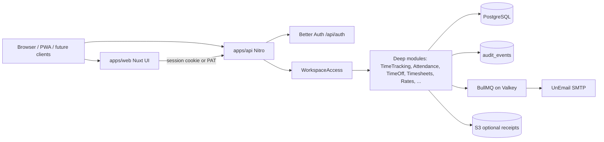

# Stampp

Stampp is a self-hosted work-time platform for teams. Track time and attendance, run timesheets and approvals, manage leave and schedules, price work with rates and budgets, and bill with expenses and invoices. Every feature ships enabled. There are no seat tiers and no feature gates.

The project is under active development and has not published a stable release yet.

## What Stampp covers

- Workspaces with built-in roles, custom roles, OIDC SSO, SAML, and SCIM provisioning
- Clients, projects, and tasks
- Running timers and manual time entries, with tags and billable flags
- Weekly timesheets and multi-stage approval chains
- Attendance punches (clock in/out) kept separate from project time
- Kiosk devices with PIN or QR punches for shared clock stations
- Time off (types, balances, holidays, team calendar) and scheduling (capacity, assignments)
- Billable and labor-cost rates, project budgets, expenses with receipts, invoices with PDF
- Reports: summary, weekly, detailed, utilization, and profitability
- Audit trail with retention policy, personal access tokens, webhooks, import and export
- Public REST API with OpenAPI, idempotent mutations, rate limits, and a typed JavaScript SDK

## How it works

Stampp is a pnpm monorepo with two deployables (`apps/web`, `apps/api`) and shared packages under `packages/`. The web app never talks to the database. It calls the API over public URLs.



Request path in plain terms:

1. The browser loads the Nuxt app and signs in through Better Auth at `/api/auth/*`.
2. Product calls hit `/api/v1/workspaces/:workspaceId/*` with a session cookie or `Authorization: Bearer stpp_…`.
3. `WorkspaceAccess` resolves membership and the required permission, then returns an `AuthorizedContext` with a workspace-scoped database handle.
4. Domain modules own the rules (overlaps, single running timer, freeze-on-submit, rate precedence, status machines). They write audit events from inside the module, not from HTTP middleware.
5. Mail is enqueued on BullMQ (Valkey) and delivered by UnEmail. Optional S3-compatible storage holds expense receipts.

PostgreSQL row-level security is defense in depth. Handlers still filter `workspace_id` on every query. Rate precedence is fixed (task, then project, then user-in-project, then user, then workspace) and never rewrites history.

Canonical product language lives in [CONTEXT.md](./CONTEXT.md). Prefer those names in code and reviews.

## Quick start with Docker

You need Docker with Compose v2.

```bash
git clone https://github.com/xcvzmoon/stampp.git
cd stampp
cp deploy/docker/.env.example deploy/docker/.env
```

Replace both placeholder secrets in `deploy/docker/.env`:

```bash
openssl rand -base64 32
```

Start the full stack:

```bash
docker compose --env-file deploy/docker/.env -f deploy/docker/compose.yaml up --build -d
docker compose --env-file deploy/docker/.env -f deploy/docker/compose.yaml ps
```

Open `http://localhost:3000`. The API listens on `http://localhost:3001`. Scalar API docs are at `http://localhost:3001/api/v1/docs`.

Compose waits for PostgreSQL and Valkey, applies pending migrations once, starts the API after `/readyz` succeeds, then starts the web app. Migration checksums stop startup if an applied migration file was edited.

Inspect startup failures:

```bash
docker compose --env-file deploy/docker/.env -f deploy/docker/compose.yaml logs migrate api web
```

Stop the stack and keep data:

```bash
docker compose --env-file deploy/docker/.env -f deploy/docker/compose.yaml down
```

Add Mailpit when testing SMTP delivery:

```bash
docker compose --env-file deploy/docker/.env -f deploy/docker/compose.yaml --profile mail up --build -d
```

Set `MAIL_MODE=smtp` in `deploy/docker/.env`, then open `http://localhost:8025`.

Optional MinIO for expense receipts:

```bash
docker compose --env-file deploy/docker/.env -f deploy/docker/compose.yaml --profile storage up --build -d
```

For an internet-facing deployment, terminate TLS at a reverse proxy, set `APP_ENV=production`, and set `PUBLIC_APP_URL` and `PUBLIC_API_URL` to their public HTTPS origins. Keep PostgreSQL and Valkey bound to loopback or drop their host ports when the proxy and apps share a private container network. Details live in [deploy/docker/README.md](./deploy/docker/README.md).

## Develop locally

You need Docker, [Vite+](https://viteplus.dev) (`vp`), and the runtime recorded in `package.json` `devEngines`. Vite+ manages the pinned Node and package-manager versions.

```bash
git clone https://github.com/xcvzmoon/stampp.git
cd stampp
vp install
cp deploy/docker/.env.example deploy/docker/.env
```

Create gitignored local env files from each app's `.env.schema` (the schemas are the single source of truth for keys, types, and defaults):

```bash
# API: required DATABASE_URL, VALKEY_URL, BETTER_AUTH_SECRET (openssl rand -base64 32)
# Web: defaults are enough for localhost; override only if your ports differ
vp run env:load
```

Use the same database password in `apps/api/.env`'s `DATABASE_URL` as in `deploy/docker/.env`. Start only the backing services and migrations:

```bash
docker compose --env-file deploy/docker/.env -f deploy/docker/compose.yaml up -d db valkey migrate
```

Or use the package scripts:

```bash
vp run services:up
vp run services:mail   # optional Mailpit
```

Run the API and web app in separate terminals:

```bash
vp run api dev
vp run web dev
```

The API exposes `GET /healthz` for process liveness and `GET /readyz` for PostgreSQL and Valkey readiness.

### Verify changes

Run the same checks CI uses, in this order:

```bash
vp run check
vp run typecheck
vp run test
vp run build
```

### Public API and SDK

Authenticated product routes live under `/api/v1`. The OpenAPI document is `GET /api/v1/openapi.json`. Integrate from Node with [`@stampp/sdk`](./packages/sdk/README.md); a runnable sample is in [`examples/integration-quickstart.mjs`](./examples/integration-quickstart.mjs).

## Future client platforms

The API stays the only product surface. Planned clients share `/api/auth` and `/api/v1` (session or personal access token). None of them invent a second backend.

| Client      | Direction | Notes                                                                                                                                          |
| ----------- | --------- | ---------------------------------------------------------------------------------------------------------------------------------------------- |
| **PWA**     | First     | Installable Nuxt shell, offline-friendly timer and timesheet paths, web push for approval reminders.                                           |
| **Desktop** | Second    | Tauri shell around the same UI. Tray timer, global shortcuts, optional idle detection. Activity tracking stays off unless the user enables it. |
| **Mobile**  | Third     | Responsive PWA first. Native shells later for background timers, OS notifications, and deeper kiosk/camera QR flows.                           |

Rough order: finish the web product surface, ship an installable PWA, wrap the app in Tauri for desktop power users, then evaluate Capacitor or native shells only where the browser cannot meet a real requirement.

## Repository layout

| Path                | Purpose                                              |
| ------------------- | ---------------------------------------------------- |
| `apps/web`          | Nuxt user interface                                  |
| `apps/api`          | Nitro API, auth, product routes, health endpoints    |
| `packages/access`   | Workspace authorization boundary (`WorkspaceAccess`) |
| `packages/database` | Drizzle schemas, scoped db, RLS helpers, migrations  |
| `packages/domain`   | Pure rules: money, duration, rates, permissions      |
| `packages/mailer`   | BullMQ queue + UnEmail mail dispatch                 |
| `packages/shared`   | Valibot schemas, error codes, shared API contracts   |
| `packages/sdk`      | Typed client for the public API                      |
| `deploy/docker`     | Dockerfiles, Compose stack, migration runner         |
| `examples`          | Integration samples against the public API           |

Package-level docs: [access](./packages/access/README.md), [database](./packages/database/README.md), [domain](./packages/domain/README.md), [mailer](./packages/mailer/README.md), [shared](./packages/shared/README.md), [sdk](./packages/sdk/README.md). App docs: [web](./apps/web/README.md), [api](./apps/api/README.md).

Environment keys are declared in `.env.schema` at the repo root and in each app. [Varlock](https://varlock.dev) loads and validates them; keep secrets in gitignored `.env` files.

## Security

Report vulnerabilities through [GitHub Security Advisories](https://github.com/xcvzmoon/stampp/security/advisories/new). Do not include secrets or customer data in a public issue.

## License

No license has been granted yet. The source is visible, but redistribution and reuse remain reserved until a license file is added.
